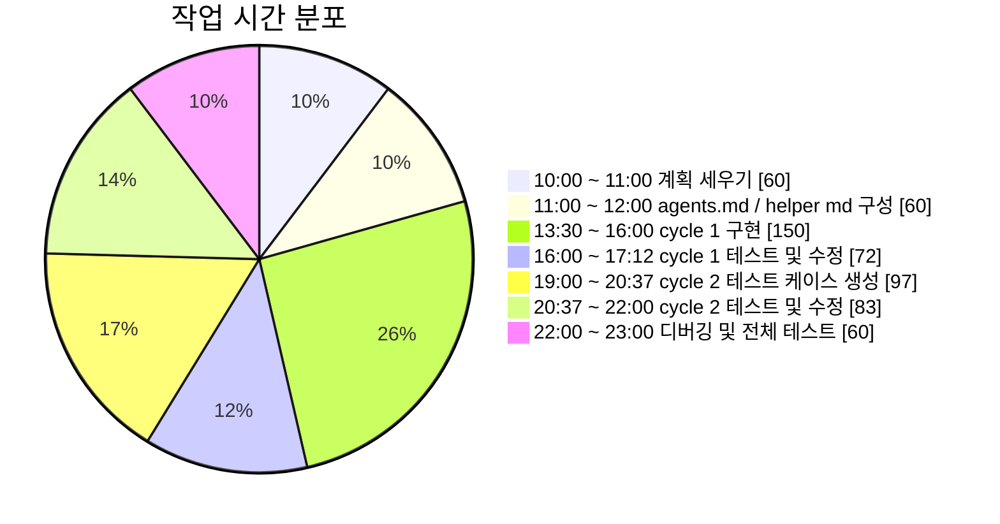

# 2조 Virtual DOM Simulator

실제 DOM을 Virtual DOM으로 바꾸고, 두 Virtual DOM을 비교해서 바뀐 부분만 실제 DOM에 반영하는 흐름을 Vanilla JavaScript로 구현했다.
여기에 undo / redo가 가능한 history, 동작을 눈으로 확인할 수 있는 UI, 그리고 Contract 중심 테스트 체계를 함께 구성했다.

---
## 전체 동작 흐름


## 팀 구성

| 담당 | 역할 | 맡은 파트 |
|---|---|---|
| 유중일 | VDOM / Render | 실제 DOM ↔ VNode 변환, 렌더링 |
| 이원재 | Diff | 이전 / 다음 VNode 비교, patch 생성 |
| 이현성 | Patch / History | 실제 DOM 부분 업데이트, undo / redo |
| 고윤서 | UI / Integration / Verification | playground UI, 버튼 연결, 통합 검증, 테스트 |

이 프로젝트는 `AGENTS.md`를 기준으로 역할을 분리해서 작업했다. 핵심 포맷과 계약은 임의로 바꾸지 않고, 각자 맡은 파트를 독립적으로 구현한 뒤 마지막에 테스트로 전체 흐름을 맞추는 방식으로 진행했다.

## 우리가 중요하게 본 것

이 프로젝트에서 가장 중요했던 건 "얼마나 멋지게 보이느냐"보다 "얼마나 안전하게 동작하느냐", "우리가 이해한 것을 어떻게 녹여냈는가?" 였다.

- 여러 명이 동시에 작업해도 충돌이 적은 구조인지
- core 로직과 UI 로직이 섞이지 않는지
- 문서에 적힌 계약을 끝까지 지키는지
- happy path만이 아니라 edge case까지 버티는지
- 테스트로 동작을 실제로 증명할 수 있는지

즉, 단순한 데모가 아니라 구조화된 구현과 검증 가능한 코드에 더 무게를 두었다.

## AGENTS.md를 어떻게 반영했는지?

`AGENTS.md`에서 가장 강하게 잡고 있던 기준은 네 가지였다.

1. 계약을 먼저 고정할 것
2. 역할별로 모듈을 나눌 것
3. 테스트를 반드시 포함할 것
4. 엣지 케이스를 놓치지 말 것

그래서 실제 구현도 다음 원칙에 맞춰 진행했다.

- VNode, Patch, HistoryState 포맷을 고정했다.
- patch 종류는 문서에 정의된 여섯 개만 사용했다.
- path 규칙은 diff와 patch 전체에서 일관되게 유지했다.
- UI에서 core 로직을 다시 짜지 않고 import해서 연결했다.
- helper를 분리해서 각 모듈을 독립적으로 테스트할 수 있게 만들었다.
- 구현과 동시에 contract / unit / integration 테스트를 같이 작성했다.

## 핵심 로직

### Virtual DOM은 어떻게 만들었는지?

실제 DOM을 읽을 때 element와 text node를 모두 같은 VNode 구조로 바꾼다.  
특히 text는 문자열로 따로 처리하지 않고 반드시 `TEXT` 타입 VNode로 통일했다. 그래야 렌더링, diff, patch, history가 모두 같은 기준으로 움직일 수 있기 때문이다.

추가로 comment node는 무시하고, `class`는 `className`으로 정규화해서 비교와 렌더링 과정에서 일관되게 다루도록 했다.

### diff 알고리즘은 어떻게 구현했는지?

diff는 이전 트리와 다음 트리를 재귀적으로 비교하면서 patch 목록을 만든다.

- 이전 노드가 없으면 `CREATE`
- 다음 노드가 없으면 `REMOVE`
- 타입이 다르면 `REPLACE`
- text가 달라지면 `TEXT`
- 속성이 달라지면 `SET_PROP` / `REMOVE_PROP`

children 비교는 index 기반뿐 아니라 key 기반 방식도 함께 검토하고 구현했다. key를 탐색해 매칭하는 과정 자체는 비교적 단순했지만, 각 태그에 안정적인 key를 부여하고 그 규칙을 전체 렌더링 흐름에서 일관되게 유지하는 부분이 더 어려웠다. 그래서 이번 프로젝트에서는 구현 복잡도가 낮고 구조를 예측하기 쉬운 index 기반 방식을 기본으로 채택하되, key 기반 비교도 별도로 확장 가능하도록 설계했다.

### patch는 어떻게 적용했는지?

patch를 적용할 때는 전체 DOM을 갈아끼우지 않고, path로 정확한 위치를 찾아 필요한 부분만 수정한다.

- 텍스트만 바뀌면 텍스트만 수정
- 속성만 바뀌면 속성만 수정
- 자식이 추가되면 그 위치에만 삽입
- 자식이 제거되면 그 노드만 제거
- 타입이 달라지면 해당 노드만 교체

즉, 최소 변경만 실제 DOM에 반영하는 방식으로 구현했다.

### history는 어떻게 다뤘는지?

history는 snapshot 배열과 현재 index로 관리한다.  
undo는 index를 뒤로, redo는 앞으로 옮긴다. 그리고 undo 이후 새 상태를 push하면 기존 future entry는 잘라낸다.

덕분에 단순히 DOM만 바꾸는 것이 아니라, 상태 흐름 자체를 안정적으로 되돌릴 수 있게 했다.

## 전체 동작 흐름

| 단계 | 설명 |
|---|---|
| 초기 로드 | real DOM을 읽어 첫 VNode를 만들고, test 영역과 history를 초기화한다 |
| Patch | 이전 VNode와 새 VNode를 비교해 patch를 만들고 real DOM에 반영한다 |
| Undo / Redo | history index를 이동한 뒤 현재 snapshot을 기준으로 다시 렌더링한다 |

## 테스트는 어떻게 했는지?

테스트는 단순 확인용으로 붙인 게 아니라, 이 프로젝트의 품질 기준 자체로 사용했다.  
특히 `AGENTS.md`에서 강조한 contract test와 edge case 대응을 실제 테스트 구조에 그대로 반영했다.


테스트는 네 단계로 나눴다.

| 분류 | 목적 |
|---|---|
| Contract Test | 공통 포맷과 계약이 깨지지 않는지 확인 |
| Unit Test | 각 모듈이 자기 책임을 제대로 수행하는지 확인 |
| Integration Test | patch, undo, redo까지 전체 흐름이 연결되는지 확인 |
| Concurrency-like / Load Test | 빠른 연속 실행, 큰 입력, 반복 churn에서도 안정적인지 확인 |

추가로 외부 라이브러리 없이 바로 돌릴 수 있도록 경량 테스트 러너와 fake DOM 환경도 같이 만들었다.

## 대표 테스트 케이스

### 일반 케이스

- DOM -> VNode -> DOM 변환이 정상적으로 왕복되는지
- text 변경 시 `TEXT` patch가 정확히 생성되는지
- prop 변경과 제거가 `SET_PROP`, `REMOVE_PROP`으로 분리되는지
- child 추가/삭제 시 index 기반 path가 올바르게 계산되는지
- patch 적용 후 real DOM이 target DOM과 같아지는지
- undo / redo 시 history index와 현재 상태가 일치하는지
- patch 버튼 실행 후 real DOM, test DOM, patch log가 함께 갱신되는지

### 극단적인 케이스

가장 극단적인 경우는 아래 네 가지로 추려서 확인했다.

- 빈 문자열과 공백 텍스트가 사라지지 않는지
- 매우 깊은 path에서도 정확한 노드를 찾을 수 있는지
- root 노드 교체가 wrapper를 깨뜨리지 않고 안전하게 되는지
- 큰 중첩 트리와 반복 patch 상황에서도 최종 결과가 틀어지지 않는지

### 엣지 케이스

- comment node, null 입력, 지원하지 않는 노드 입력을 안전하게 처리하는지
- event prop과 event-like attribute를 diff와 DOM 반영에서 무시하는지
- 잘못된 path나 비정상 payload가 들어와도 DOM이 깨지지 않는지
- undo 후 새 상태를 push했을 때 future history가 잘리는지
- 외부에서 snapshot을 바꿔도 history 내부 상태가 오염되지 않는지
- 빠르게 연속 클릭해도 핸들러 순서가 꼬이지 않는지
- 반복적인 render / history churn 이후에도 상태가 안정적으로 유지되는지

이 테스트들은 단순히 "돌아간다"를 확인하는 수준이 아니라, 흔들리기 쉬운 조건에서도 구조가 안전한지 확인하는 데 초점을 맞췄다.

## 작업 시간



## 품질 검증 포인트

우리가 실제로 확인한 품질 기준은 아래와 같다.

- 문서 계약을 끝까지 유지했는가
- core 로직이 UI에 중복되지 않는가
- path, root, history 같은 취약 지점을 안전하게 다루는가
- 부분 업데이트가 실제로 부분 업데이트로 동작하는가
- undo / redo와 새 patch 조합에서도 상태가 꼬이지 않는가
- 반복 실행이나 큰 입력에서도 결과가 결정적으로 유지되는가

## 실행 방법

| 작업 | 명령어 |
|---|---|
| 테스트 실행 | `npm test` |
| 정적 서버 실행 | `python -m http.server 4173` |

브라우저에서 `http://127.0.0.1:4173` 으로 접속하면 playground를 확인할 수 있다.

## 폴더 구조

```text
virtualDom/
├─ src/
│  ├─ core/
│  │  ├─ types.js         # VNode 기본 형식과 텍스트 노드 규칙
│  │  ├─ domToVNode.js    # 실제 DOM -> VNode 변환
│  │  ├─ vNodeToDOM.js    # VNode -> 실제 DOM 생성
│  │  ├─ render.js        # 컨테이너 렌더링
│  │  ├─ diff.js          # 두 VNode 비교 후 patch 생성
│  │  ├─ patch.js         # patch를 실제 DOM에 적용
│  │  └─ history.js       # snapshot 기반 undo / redo
│  └─ ui/
│     ├─ app.js           # 전체 UI 흐름 제어
│     ├─ bindings.js      # 버튼, 상태, 로그 바인딩
│     └─ fixtures.js      # UI 메시지와 기본 데이터
├─ tests/
│  ├─ contracts/          # 공통 계약 검증
│  ├─ unit/               # 모듈 단위 테스트
│  ├─ integration/        # 전체 흐름 테스트
│  ├─ fixtures/           # 테스트용 샘플 데이터
│  └─ helpers/            # fake DOM, test harness 등 보조 도구
├─ docs/
│  ├─ development-plan.md
│  ├─ commit-convention.md
│  ├─ vnode-spec-v1.0.md
│  └─ text-node-rules-v1.0.md
├─ index.html
├─ style.css
└─ README.md
```

## 참고 문서

- `AGENTS.md`  
  역할 분리와 공통 작업 원칙을 정리한 기준 문서
- `docs/development-plan.md`  
  구현 순서와 전체 개발 방향을 잡는 문서
- `docs/commit-convention.md`  
  커밋 메시지와 작업 단위 규칙을 맞추기 위한 문서
- `docs/vnode-spec-v1.0.md`  
  VNode 구조를 고정하기 위한 문서
- `docs/text-node-rules-v1.0.md`  
  TEXT 노드 처리 기준을 통일하기 위한 문서
